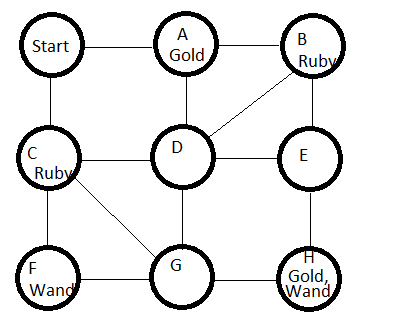

# Solve the Maze Puzzle using Davis-Putnam
## Davis-Putnam algorithm for solving a simple form of an adventure game

## Puzzle
- A maze with treasures at particular nodes.
- A maximum number of steps. 
- If a player goes to a node, then they get all the treasures at that node. 
- The object is to find a path through the maze starting at START in at most the given number of steps that collects all the different types of treasure.

## Propositional logic
- `At(N,I)` means that the player is on node N at time I. For instance `At(C,2)` means that the player is on node C at time 2.
- `Has(T,I)` means that the player is in possession of treasure T at time I. For example, `Has(Gold,3)` means that the player has the gold at time 3.

## Categories of propositions
1. The player is only at one place at a time.
For any time I, for any two distinct nodes M and N, `¬(At(M,I) ∧ At(N,I))`.  
In CNF this becomes `¬At(M,I) ∨ ¬At(N,I)`.  
For example, `¬At(C,2) ∨ ¬At(F,2)`.

2. The player must move on edges. Suppose that node N is connected to M1 ... Mq. For any time I, if the player is at node N at time I, then the player moves to M1 or to M2 ... or to Mq at time I+1.  
Thus `At(N,I) → At(M1,I+1) ∨ ... ∨ At(Mq,I+1)`.  
In CNF, `¬At(N,I) ∨ At(M1,I+1) ∨... ∨ At(Mk,I+1)`.  
For example, `¬At(C,2) ∨ At(START,3) ∨ At(D,3) ∨ At(F,3) ∨ At(G,3)`.

3. Suppose that treasure T is located at node N. Then if the player is at N at time I, then at time I the player has T.  
`At(N,I) → Has(T,I)`.  
In CNF, `¬At(N,I) ∨ Has(T,I). For example ¬At(C,2) ∨ Has(Ruby,2)`.

4. If the player has treasure T at time I-1, then the player has T at time I. (I=1..K)  .
`Has(T,I-1) → Has(T,I)`.  
In CNF, `¬Has(T,I-1) ∨ Has(T,I)`.  
For example `¬Has(GOLD,2) ∨ Has(GOLD,3)`.

5. Let M1 ... Mq be the nodes that supply treasure T. If the player does not have treasure T at time I-1 and has T at time I, then at time I they must be at one of the nodes M1 ... Mq.  
`[¬Has(T,I-1) ∧Has(T,I)] → At(M1,I) ∨ At(M2,I) ∨ ... ∨At(Mq,I)`.  
In CNF, `Has(T,I-1) ∨ ¬Has(T,I) ∨ At(M1,I) ∨ At(M2,I) ∨ ... ∨At(Mq,I)`.  
For example, `Has(GOLD,1) ∨ ¬Has(GOLD,2) ∨ At(A,2) ∨ At(H,2)`.

6. The player is at START at time 0. `At(START,0)`.

7. At time 0, the player has none of the treasures.  
For each treasure T, `¬Has(T,0)`.  
For instance: `¬Has(GOLD,0)`.

8. At time K, the player has all the treasures.  
For each treasure T, `Has(T,K)`.  
For instance: `Has(GOLD,4)`.

## Specifications

### Front end
- The front end takes as input a specification of a maze and a problem and generates as output a set of clauses to be satisfied.
- The format of the input contains the following elements:
    - First line: A list of the nodes, separated by white space. Each node is a string of up to five characters.
    - Second line: A list of the treasures, separated by white space. Each treasure is a string of up to ten characters.
    - Third line: The number of allowed steps.
    - Remaining lines: The encoding of the maze. Each line consists
        - A node N.
        - The keyword "TREASURES" followed by the list of treasures, separated by white space.
        - The keyword "NEXT" followed by the list of nodes that N is connected to, separated by white space.
- The output consists of

    1. A set of clauses suitable for inputting to Davis-Putnam as described above. Note that these constraints are already in clausal form (CNF) and therefore you do not have to implement a program to translate arbitrary Boolean formulas to CNF.
    2. A key to allow the back end to translate the numbers used for propositional atoms in the clauses into the correct path. The format of this is up to you. My suggestion would be that, for each atom At(N,I), you have a line of the form "proposition-number N I"

### Back end
The back end takes as input the output that Davis-Putnam generates when run on the output of the front end. It generates as output the path that solves the problem. If the input indicates that the clauses have no solution, the back end should output the message "NO SOLUTION".

## How to run
I have total 4 classes: Front, Back, Maze, and Solver.
To run my code, you only need to run Main.ipynb file.
To run Davis-Putnam seperately, do following example:

dp = Solver()
dp.getInput('FrontEndOutput.txt') // Here, you have to put input file name.
    
CS = dp.getCS()
B = dp.getB()

dp.dpll(CS, B)
dp.formatting() // This will generate output.txt.